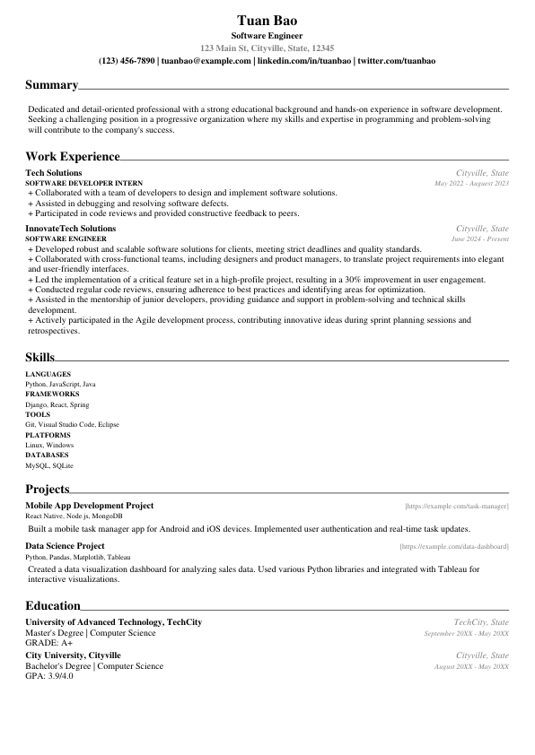
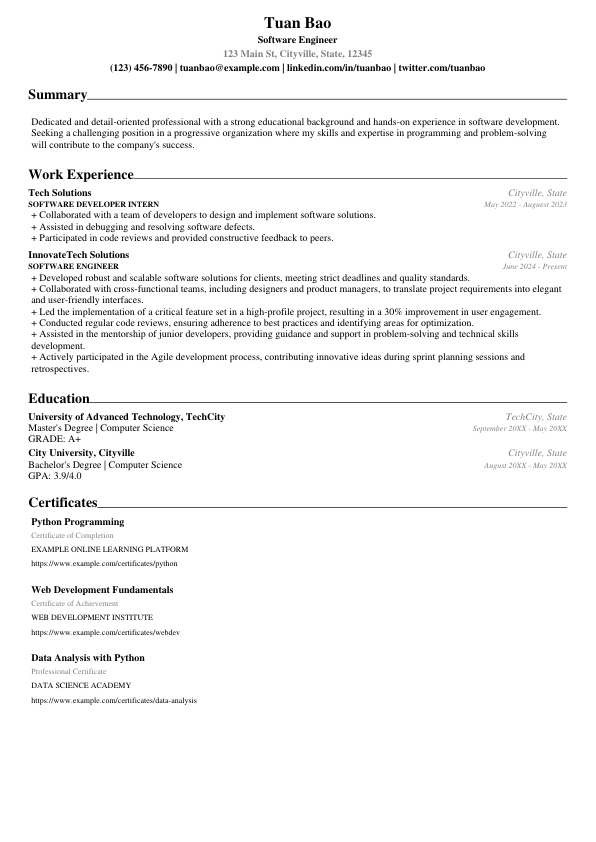
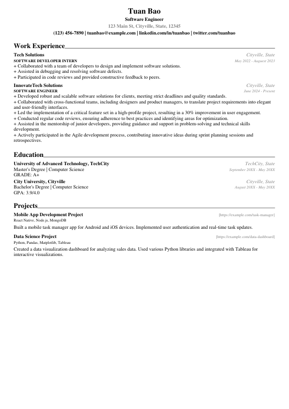

# 📝Resume Builder

This project is designed to help users create professional resumes using Python. With the simplicity of the Python programming language and the convenience of the Python terminal, creating customized resumes has never been easier.

<!-- Example resumes -->
<div style="width: 200px; height: 282px; display: flex; flex-direction: row; justify-content: space-between;">
    
    
    
</div>

# Demo:


# Installation:
##### 1 . Clone the repository:
```bash
git clone https://github.com/hoangtuanbaonguyen/ResumeBuilder.git
cd ResumeBuilder
```
##### 2 . Install Python (if not already installed):

* [Python 3.5 and later versions](https://www.python.org/downloads/)

##### 3 . Install the required packages:


```bash
pip install -r requirements.txt
```

##### Requirements
* [prompt_toolkit 3.0](https://python-prompt-toolkit.readthedocs.io/en/master/)
* [mypy](https://mypy.readthedocs.io/en/stable/)
* [fpdf2](https://pypi.org/project/fpdf2/)
# Usage
- Run ResumeBuilder:
```bash
python project.py
```
- Follow the prompt in the terminal to input your personal information, summary, work experiences, projects, educations, skills, etc.
- Type '**quit**' or '**q**' to save and exit the terminal. The application will generate a resume and save it as a PDF file in the project directory.

# License:

This project is licensed under the [GNU General Public License v3.0](LICENSE) - see the LICENSE file for details.
# Happy Coding! 😊

Thank you for checking out this project! We hope you find it helpful and inspiring. If you have any questions, issues, or ideas for improvement, feel free to get in touch. Happy coding!


